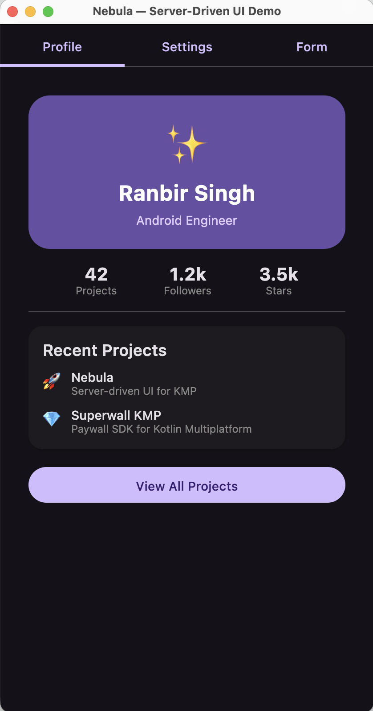

<p align="center">
  
</p>

<p align="center">
  
  
  
  
  
</p>

# Nebula

Server-driven native UI for Kotlin Multiplatform. Your backend sends JSON — Nebula renders it as native Material 3 composables. One dependency. All platforms.

## How It Works

```
Backend JSON                          Native UI
─────────────                         ─────────
{ "type": "column",                   Column {
  "spacing": 16,                →       Text("Welcome back")
  "children": [                         Card { ... }
    { "type": "text", ... },            Button("Get Started")
    { "type": "card", ... },          }
    { "type": "button", ... }
  ]
}
```

The backend defines the entire UI as a JSON component tree. Nebula walks the tree and renders each node as a native Compose composable. Change copy, layout, colors — no app update needed.

## Setup

```kotlin
// build.gradle.kts
dependencies {
  implementation("io.github.androidpoet:nebula:0.1.0")
}
```

## Usage

### Render JSON as Native UI

```kotlin
Nebula(json = serverResponse) { action ->
  when (action) {
    is NebulaAction.OpenUrl -> openBrowser(action.url)
    is NebulaAction.Custom -> handleEvent(action.name, action.data)
    is NebulaAction.Navigate -> navController.navigate(action.route)
    else -> {}
  }
}
```

### With Variables

```kotlin
Nebula(
  json = serverResponse,
  variables = mapOf(
    "user.name" to "Ranbir Singh",
    "user.plan" to "Pro",
    "stats.projects" to "42",
  ),
)
```

Variables resolve `{{ user.name }}` → `Ranbir Singh` in any text component. They're reactive — update the store and the UI recomposes.

### Custom Image Loader

```kotlin
Nebula(
  json = serverResponse,
  imageLoader = { url, contentDescription, modifier ->
    AsyncImage(
      model = url,
      contentDescription = contentDescription,
      modifier = modifier,
    )
  },
)
```

Nebula doesn't bundle an image loader — bring your own (Coil, Kamel, etc.).

### Custom Components

```kotlin
val registry = remember { NebulaRegistry() }

registry.register("video_player") { component ->
  VideoPlayer(
    url = component.properties["url"]?.jsonPrimitive?.content ?: "",
  )
}

Nebula(json = serverResponse, registry = registry)
```

Register any composable for custom component types. The backend sends `{"type": "custom", "type": "video_player", "properties": {...}}` and your renderer handles it.

## 27 Built-in Components

### Layout
| Component | Renders As | Purpose |
|-----------|-----------|---------|
| `column` | Column | Vertical layout with spacing & alignment |
| `row` | Row | Horizontal layout with spacing & alignment |
| `box` | Box | Overlay/stack layout with content alignment |
| `lazy_column` | LazyColumn | Scrollable vertical list |
| `lazy_row` | LazyRow | Scrollable horizontal list |
| `flow_row` | FlowRow | Wrapping horizontal layout |
| `flow_column` | FlowColumn | Wrapping vertical layout |
| `spacer` | Spacer | Flexible or fixed spacing |

### Display
| Component | Renders As | Purpose |
|-----------|-----------|---------|
| `text` | Text | Material 3 typography with variable resolution |
| `image` | Custom loader | Remote/local images via your image loader |
| `icon` | Icon | Named icons with tint and size |
| `divider` | HorizontalDivider | Separator line |
| `progress_indicator` | Circular/Linear | Determinate or indeterminate progress |
| `badge` | Badge | Notification badge with optional label |

### Interactive
| Component | Renders As | Purpose |
|-----------|-----------|---------|
| `button` | Button | 5 styles: filled, outlined, elevated, text, tonal |
| `icon_button` | IconButton | Tappable icon |
| `text_field` | OutlinedTextField | Text input with label and placeholder |
| `checkbox` | Checkbox | Toggle with label |
| `switch` | Switch | Toggle switch with label |
| `slider` | Slider | Range input with min/max/steps |

### Container
| Component | Renders As | Purpose |
|-----------|-----------|---------|
| `card` | Card | Elevated container with shape and color |
| `scaffold` | Scaffold | App structure with top bar, bottom bar, FAB |
| `top_app_bar` | TopAppBar | Title, navigation icon, actions |

### Meta
| Component | Renders As | Purpose |
|-----------|-----------|---------|
| `conditional` | — | Show/hide based on variable truthiness |
| `custom` | Your composable | Extensible via NebulaRegistry |

## Variable Templates

```
{{ user.name }}        → Ranbir Singh
{{ stats.projects }}   → 42
{{ product.price }}    → $9.99
```

Variables live in a reactive `VariableStore`. Update a value and every text referencing it recomposes automatically.

## Modifier System

Every component accepts a modifier object for styling:

```json
{
  "type": "box",
  "modifier": {
    "fillMaxWidth": true,
    "padding": { "all": 16 },
    "background": "#6750A4",
    "shape": { "type": "rounded", "cornerRadius": 24 },
    "shadow": { "elevation": 8 },
    "border": { "width": 1, "color": "#FFFFFF" },
    "alpha": 0.9,
    "rotate": 5,
    "clickAction": { "type": "custom", "name": "tapped" }
  }
}
```

Supports: size, padding, background, shape, border, shadow, scroll, alpha, clip, rotation, scale, offset, and click actions.

## Actions

Components fire actions that your app handles:

| Action | Purpose |
|--------|---------|
| `navigate` | Navigate to a route |
| `back` | Go back |
| `open_url` | Open URL in browser |
| `set_value` | Update a variable |
| `custom` | Named event with data payload |
| `multi` | Execute multiple actions in sequence |
| `snackbar` | Show a snackbar message |

## Targets

| Platform | Target | Status |
|----------|--------|--------|
| Android | `androidTarget` | Stable |
| iOS | `iosArm64`, `iosX64`, `iosSimulatorArm64` | Stable |
| macOS | `macosArm64`, `macosX64` | Experimental |
| Desktop | `jvm("desktop")` | Stable |

## Architecture

```
nebula/
├── nebula-core/                     ← Single library module
│   └── commonMain/
│       ├── Nebula.kt               ← Entry point composable + JSON parser
│       ├── components/
│       │   ├── NebulaComponent.kt  ← 27 sealed component types
│       │   ├── NebulaModifier.kt   ← Unified modifier model
│       │   ├── NebulaAction.kt     ← 7 action types
│       │   ├── TextStyle.kt        ← Typography with M3 roles
│       │   └── Enums.kt           ← Alignment, arrangement, etc.
│       ├── renderer/
│       │   ├── NebulaRenderer.kt   ← Recursive component → Compose mapper
│       │   ├── ModifierResolver.kt ← NebulaModifier → Compose Modifier
│       │   ├── ColorResolver.kt    ← Hex, named, Material colors
│       │   └── NebulaRegistry.kt   ← Custom component registration
│       └── variable/
│           ├── VariableStore.kt    ← Reactive variable storage
│           └── VariableResolver.kt ← {{ template }} resolution
└── sample/                          ← Desktop demo app
```

## Tech Stack

| Layer | Library |
|-------|---------|
| UI | [Compose Multiplatform](https://www.jetbrains.com/lp/compose-multiplatform/) 1.7.3 |
| Design | [Material 3](https://m3.material.io/) |
| Serialization | [kotlinx.serialization](https://github.com/Kotlin/kotlinx.serialization) 1.7.3 |
| Async | [kotlinx.coroutines](https://github.com/Kotlin/kotlinx.coroutines) 1.9 |
| Build | Kotlin 2.1.0, Gradle 8.9 |

Zero heavy dependencies. No networking library. No image loader. Just Compose + serialization.

## Build

```bash
# All targets
./gradlew build

# Desktop only
./gradlew :nebula-core:compileKotlinDesktop

# Run sample
./gradlew :sample:run
```

## License

```
Copyright 2026 androidpoet (Ranbir Singh)

Licensed under the Apache License, Version 2.0 (the "License");
you may not use this file except in compliance with the License.
You may obtain a copy of the License at

   http://www.apache.org/licenses/LICENSE-2.0

Unless required by applicable law or agreed to in writing, software
distributed under the License is distributed on an "AS IS" BASIS,
WITHOUT WARRANTIES OR CONDITIONS OF ANY KIND, either express or implied.
See the License for the specific language governing permissions and
limitations under the License.
```
