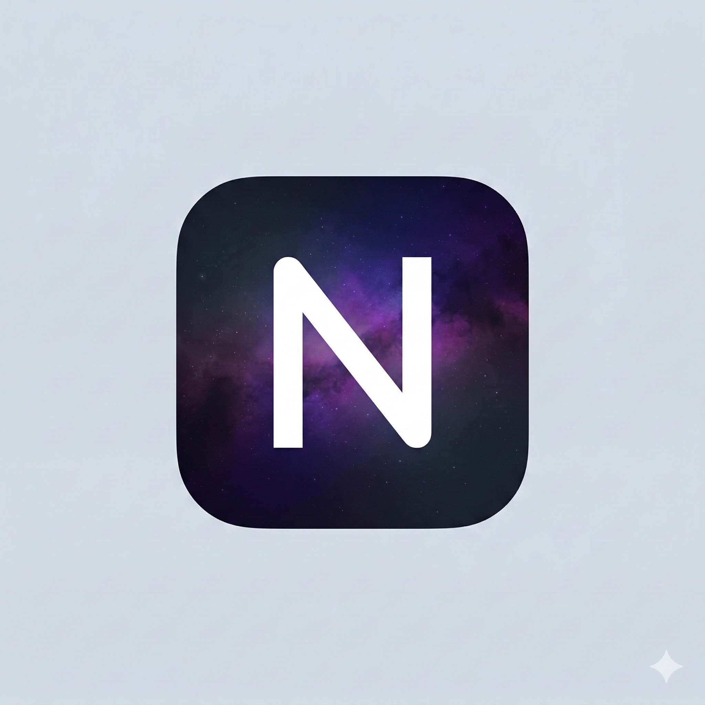

<p align="center">
  
</p>

<p align="center">
  
</p>

<p align="center">
  
  
  
  
  
</p>

# Nebula

Server-driven native UI for Kotlin Multiplatform. Two rendering paths — JSON for rapid prototyping, binary wire protocol for production performance. All platforms.

## Two Rendering Paths

| Path | Format | Latency | Use Case |
|------|--------|---------|----------|
| **JSON** | Human-readable JSON | ~ms parse | Prototyping, CMS-driven UI, A/B tests |
| **Binary Protocol** | Compact byte stream | ~us parse | Production apps, real-time updates, animations |

Both render as native Material 3 composables. No custom layout engine — Compose handles layout, text shaping, and accessibility natively.

## Modules

```
io.github.androidpoet:nebula:0.1.0                    // JSON SDUI
io.github.androidpoet:nebula-protocol:0.1.0            // Binary wire protocol (pure Kotlin, no Compose)
io.github.androidpoet:nebula-protocol-creation:0.1.0   // Server-side authoring DSL
io.github.androidpoet:nebula-protocol-player:0.1.0     // Compose renderer for binary documents
```

Pick only what you need:

```kotlin
// Client app — render binary documents from your server
implementation("io.github.androidpoet:nebula-protocol-player:0.1.0")

// Server/backend — create binary documents (no Compose dependency)
implementation("io.github.androidpoet:nebula-protocol-creation:0.1.0")

// JSON SDUI path
implementation("io.github.androidpoet:nebula:0.1.0")

// Custom tooling — direct wire buffer access
implementation("io.github.androidpoet:nebula-protocol:0.1.0")
```

---

## Binary Wire Protocol

A compact binary format modeled after [AndroidX Compose Remote](https://android.googlesource.com/platform/frameworks/support/+/refs/heads/main/glance/glance-appwidget/src/main/java/androidx/glance/appwidget/RemoteViewsTranslator.kt). Server creates a document as bytes, client renders it as native Compose UI.

### Server Side — Create Documents

```kotlin
// build.gradle.kts
implementation("io.github.androidpoet:nebula-protocol-creation:0.1.0")
```

**Kotlin DSL:**

```kotlin
val bytes = remoteDocument(width = 400f, height = 800f) {
  val titleStyle = textStyle {
    fontSize = 24f
    fontWeight = 700
    color = 0xFF1A1A1A
  }
  val bodyStyle = textStyle { fontSize = 16f }

  column(spacing = 16f) {
    modPadding(24f)
    modBackground(0xFFF5F5F5, cornerRadius = 16f)

    layoutText(text("Welcome to Nebula"), titleStyle)
    layoutText(text("Server-driven native UI"), bodyStyle)

    row(spacing = 8f) {
      button("Get Started") { hostNamedAction("navigate", "{\"route\":\"onboarding\"}") }
      button("Learn More") { hostNamedAction("open_url", "{\"url\":\"https://github.com/AndroidPoet/nebula\"}") }
    }
  }
}

// Send `bytes` over HTTP, WebSocket, gRPC, etc.
```

**Reactive Expressions:**

```kotlin
val bytes = remoteDocument(400f, 800f) {
  // Animated float using RPN expressions with operator overloading
  val pulse = rFloat { (CONTINUOUS_SEC * const(2f)) % const(1f) }

  canvas(200f, 200f) {
    paint(color = 0xFF6750A4)
    drawCircle(100f, 100f, 50f)
  }
}
```

**Canvas Drawing:**

```kotlin
val bytes = remoteDocument(400f, 400f) {
  canvas(width = 400f, height = 400f) {
    paint(color = 0xFFFF0000, strokeWidth = 2f)
    drawRect(10f, 10f, 190f, 190f)
    drawRoundRect(200f, 10f, 390f, 190f, rx = 12f)
    drawCircle(100f, 300f, 80f)
    drawLine(200f, 220f, 390f, 390f)

    withTransform {
      translate(200f, 200f)
      rotate(45f)
      drawRect(0f, 0f, 100f, 100f)
    }
  }
}
```

### Client Side — Render Documents

```kotlin
// build.gradle.kts
implementation("io.github.androidpoet:nebula-protocol-player:0.1.0")
```

```kotlin
NebulaRemote(
  bytes = wireBytes,
  onAction = { id -> handleAction(id) },
  onNamedAction = { name, metadata -> handleNamedAction(name, metadata) },
)
```

The player handles layout, text, modifiers, animations, theming, and actions — all rendered as native Compose composables.

### Protocol Architecture

```
Server (any JVM/Kotlin target)          Client (Compose Multiplatform)
──────────────────────────              ──────────────────────────────
remoteDocument { ... }                  NebulaRemote(bytes)
       │                                      │
  RemoteComposeWriter                    CoreDocument
       │                                      │
   WireBuffer                          ┌──────┴──────┐
       │                               │             │
  ByteArray ──── network ────→    DATA pass     PAINT pass
                                  (resources)   (render tree)
                                       │             │
                                  RemoteContext  Compose UI
```

**Wire format:** 1-byte opcodes, size-prefixed blocks, NaN-encoded float variable IDs (IEEE 754), RPN expression engine with 71 operators.

**Dual-pass execution:**
1. **DATA pass** — Loads text, colors, floats, named variables, expressions
2. **PAINT pass** — Walks the component tree and renders via Compose

### Protocol Features

| Category | Operations |
|----------|-----------|
| **Layout** | Column, Row, Box, Canvas, Flow, FitBox, CollapsibleRow/Column, State, Content |
| **Text** | Text, TextStyle (size, weight, color, spacing, alignment, italic, decoration), TextMerge, TextFromFloat |
| **Modifiers** | Width, Height, Padding, Background, Border, ClipRect, RoundedClip, Click, Visibility, Offset, Scroll, ZIndex, GraphicsLayer, TouchDown/Up |
| **Draw** | Rect, RoundRect, Circle, Oval, Line, Arc, Path, Bitmap, TextRun, TextAnchor, ClipRect/Path |
| **Transform** | Save, Restore, Translate, Rotate, Scale, Skew |
| **Data** | Float, AnimatedFloat, Text, Int, Boolean, Long, Color, NamedVariable, FloatList, ColorExpression, IntegerExpression, TouchExpression |
| **Actions** | HostAction, HostNamedAction, ValueIntegerChange, ValueFloatChange, RunAction, Conditional, LoopStart, Skip |
| **Animation** | Linear, EaseIn, EaseOut, EaseInOut, Spring, Overshoot, Bounce, Anticipate + spring physics engine |
| **Expressions** | 71 RPN operators: arithmetic, trig, rounding, comparisons, logic, easing, waves, stack manipulation |

---

## JSON SDUI

### How It Works

```
Backend JSON                          Native UI
─────────────                         ─────────
{ "type": "column",                   Column {
  "spacing": 16,                →       Text("Welcome back")
  "children": [                         Card { ... }
    { "type": "text", ... },            Button("Get Started")
    { "type": "card", ... },          }
    { "type": "button", ... }
  ]
}
```

The backend defines the entire UI as a JSON component tree. Nebula walks the tree and renders each node as a native Compose composable.

### Setup

```kotlin
// build.gradle.kts
implementation("io.github.androidpoet:nebula:0.1.0")
```

### Render JSON as Native UI

```kotlin
Nebula(json = serverResponse) { action ->
  when (action) {
    is NebulaAction.OpenUrl -> openBrowser(action.url)
    is NebulaAction.Custom -> handleEvent(action.name, action.data)
    is NebulaAction.Navigate -> navController.navigate(action.route)
    else -> {}
  }
}
```

### With Variables

```kotlin
Nebula(
  json = serverResponse,
  variables = mapOf(
    "user.name" to "Ranbir Singh",
    "user.plan" to "Pro",
    "stats.projects" to "42",
  ),
)
```

Variables resolve `{{ user.name }}` → `Ranbir Singh` in any text component. They're reactive — update the store and the UI recomposes.

### Custom Image Loader

```kotlin
Nebula(
  json = serverResponse,
  imageLoader = { url, contentDescription, modifier ->
    AsyncImage(
      model = url,
      contentDescription = contentDescription,
      modifier = modifier,
    )
  },
)
```

Nebula doesn't bundle an image loader — bring your own (Coil, Kamel, etc.).

### Custom Components

```kotlin
val registry = remember { NebulaRegistry() }

registry.register("video_player") { component ->
  VideoPlayer(
    url = component.properties["url"]?.jsonPrimitive?.content ?: "",
  )
}

Nebula(json = serverResponse, registry = registry)
```

Register any composable for custom component types. The backend sends `{"type": "custom", "type": "video_player", "properties": {...}}` and your renderer handles it.

### 27 Built-in Components

#### Layout
| Component | Renders As | Purpose |
|-----------|-----------|---------|
| `column` | Column | Vertical layout with spacing & alignment |
| `row` | Row | Horizontal layout with spacing & alignment |
| `box` | Box | Overlay/stack layout with content alignment |
| `lazy_column` | LazyColumn | Scrollable vertical list |
| `lazy_row` | LazyRow | Scrollable horizontal list |
| `flow_row` | FlowRow | Wrapping horizontal layout |
| `flow_column` | FlowColumn | Wrapping vertical layout |
| `spacer` | Spacer | Flexible or fixed spacing |

#### Display
| Component | Renders As | Purpose |
|-----------|-----------|---------|
| `text` | Text | Material 3 typography with variable resolution |
| `image` | Custom loader | Remote/local images via your image loader |
| `icon` | Icon | Named icons with tint and size |
| `divider` | HorizontalDivider | Separator line |
| `progress_indicator` | Circular/Linear | Determinate or indeterminate progress |
| `badge` | Badge | Notification badge with optional label |

#### Interactive
| Component | Renders As | Purpose |
|-----------|-----------|---------|
| `button` | Button | 5 styles: filled, outlined, elevated, text, tonal |
| `icon_button` | IconButton | Tappable icon |
| `text_field` | OutlinedTextField | Text input with label and placeholder |
| `checkbox` | Checkbox | Toggle with label |
| `switch` | Switch | Toggle switch with label |
| `slider` | Slider | Range input with min/max/steps |

#### Container
| Component | Renders As | Purpose |
|-----------|-----------|---------|
| `card` | Card | Elevated container with shape and color |
| `scaffold` | Scaffold | App structure with top bar, bottom bar, FAB |
| `top_app_bar` | TopAppBar | Title, navigation icon, actions |

#### Meta
| Component | Renders As | Purpose |
|-----------|-----------|---------|
| `conditional` | — | Show/hide based on variable truthiness |
| `custom` | Your composable | Extensible via NebulaRegistry |

### Variable Templates

```
{{ user.name }}        → Ranbir Singh
{{ stats.projects }}   → 42
{{ product.price }}    → $9.99
```

Variables live in a reactive `VariableStore`. Update a value and every text referencing it recomposes automatically.

### Modifier System

```json
{
  "type": "box",
  "modifier": {
    "fillMaxWidth": true,
    "padding": { "all": 16 },
    "background": "#6750A4",
    "shape": { "type": "rounded", "cornerRadius": 24 },
    "shadow": { "elevation": 8 },
    "border": { "width": 1, "color": "#FFFFFF" },
    "alpha": 0.9,
    "rotate": 5,
    "clickAction": { "type": "custom", "name": "tapped" }
  }
}
```

Supports: size, padding, background, shape, border, shadow, scroll, alpha, clip, rotation, scale, offset, and click actions.

### Actions

| Action | Purpose |
|--------|---------|
| `navigate` | Navigate to a route |
| `back` | Go back |
| `open_url` | Open URL in browser |
| `set_value` | Update a variable |
| `custom` | Named event with data payload |
| `multi` | Execute multiple actions in sequence |
| `snackbar` | Show a snackbar message |

---

## Targets

| Platform | Target | Status |
|----------|--------|--------|
| Android | `androidTarget` | Stable |
| iOS | `iosArm64`, `iosX64`, `iosSimulatorArm64` | Stable |
| macOS | `macosArm64`, `macosX64` | Experimental |
| Desktop | `jvm("desktop")` | Stable |

## Architecture

```
nebula/
├── nebula-core/                         ← JSON SDUI (io.github.androidpoet:nebula)
│   └── commonMain/
│       ├── Nebula.kt                    ← Entry point composable + JSON parser
│       ├── components/
│       │   ├── NebulaComponent.kt       ← 27 sealed component types
│       │   ├── NebulaModifier.kt        ← Unified modifier model
│       │   ├── NebulaAction.kt          ← 7 action types
│       │   ├── TextStyle.kt             ← Typography with M3 roles
│       │   └── Enums.kt                ← Alignment, arrangement, etc.
│       ├── renderer/
│       │   ├── NebulaRenderer.kt        ← Recursive component → Compose mapper
│       │   ├── ModifierResolver.kt      ← NebulaModifier → Compose Modifier
│       │   ├── ColorResolver.kt         ← Hex, named, Material colors
│       │   └── NebulaRegistry.kt        ← Custom component registration
│       └── variable/
│           ├── VariableStore.kt         ← Reactive variable storage
│           └── VariableResolver.kt      ← {{ template }} resolution
│
├── nebula-protocol/                     ← Binary wire protocol (io.github.androidpoet:nebula-protocol)
│   └── commonMain/                        Pure Kotlin — no Compose dependency
│       ├── WireBuffer.kt               ← Binary read/write with size-prefixed blocks
│       ├── core/
│       │   ├── Operations.kt            ← 130+ opcodes (1-byte, matches AndroidX)
│       │   ├── NanEncoding.kt           ← IEEE 754 NaN-encoded variable IDs
│       │   ├── Operation.kt             ← Base class + RemoteContext
│       │   ├── ComponentOperation.kt    ← Container/leaf component model
│       │   └── CoreDocument.kt          ← Document parser, tree inflation, dual-pass execution
│       ├── engine/
│       │   ├── FloatExpression.kt       ← RPN evaluator with 71 operators
│       │   ├── FloatAnimation.kt        ← 8 easing types
│       │   └── SpringStopEngine.kt      ← Damped spring physics
│       └── operations/
│           ├── ProtocolOps.kt           ← Header, theme, debug, haptics, a11y
│           ├── DataOps.kt               ← Float, text, color, expressions
│           ├── DrawOps.kt               ← Rect, circle, arc, path, bitmap
│           ├── TransformOps.kt          ← Matrix save/restore/translate/rotate/scale
│           ├── LayoutOps.kt             ← Column, row, box, canvas, flow, text
│           ├── ModifierOps.kt           ← Padding, background, border, click, scroll
│           └── ActionOps.kt             ← Host actions, conditionals, loops
│
├── nebula-protocol-creation/            ← Authoring API (io.github.androidpoet:nebula-protocol-creation)
│   └── commonMain/                        Pure Kotlin — no Compose dependency
│       └── creation/
│           ├── RemoteComposeWriter.kt   ← Low-level procedural API
│           └── RemoteComposeContext.kt  ← Kotlin DSL (remoteDocument { })
│
├── nebula-protocol-player/              ← Compose renderer (io.github.androidpoet:nebula-protocol-player)
│   └── commonMain/
│       └── player/
│           └── RemoteComposePlayer.kt   ← NebulaRemote() composable
│
└── sample/                              ← Desktop demo app
```

## Tech Stack

| Layer | Library |
|-------|---------|
| UI | [Compose Multiplatform](https://www.jetbrains.com/lp/compose-multiplatform/) 1.7.3 |
| Design | [Material 3](https://m3.material.io/) |
| Serialization | [kotlinx.serialization](https://github.com/Kotlin/kotlinx.serialization) 1.7.3 |
| Async | [kotlinx.coroutines](https://github.com/Kotlin/kotlinx.coroutines) 1.9 |
| Build | Kotlin 2.1.0, Gradle 8.9 |

Zero heavy dependencies. No networking library. No image loader. Just Compose + serialization.

## Build

```bash
# All desktop targets
./gradlew :nebula-core:compileKotlinDesktop :nebula-protocol:compileKotlinDesktop :nebula-protocol-creation:compileKotlinDesktop :nebula-protocol-player:compileKotlinDesktop

# Run protocol tests (151 tests)
./gradlew :nebula-protocol:desktopTest :nebula-protocol-creation:desktopTest

# Run sample
./gradlew :sample:run
```

## License

```
Copyright 2026 androidpoet (Ranbir Singh)

Licensed under the Apache License, Version 2.0 (the "License");
you may not use this file except in compliance with the License.
You may obtain a copy of the License at

   http://www.apache.org/licenses/LICENSE-2.0

Unless required by applicable law or agreed to in writing, software
distributed under the License is distributed on an "AS IS" BASIS,
WITHOUT WARRANTIES OR CONDITIONS OF ANY KIND, either express or implied.
See the License for the specific language governing permissions and
limitations under the License.
```
